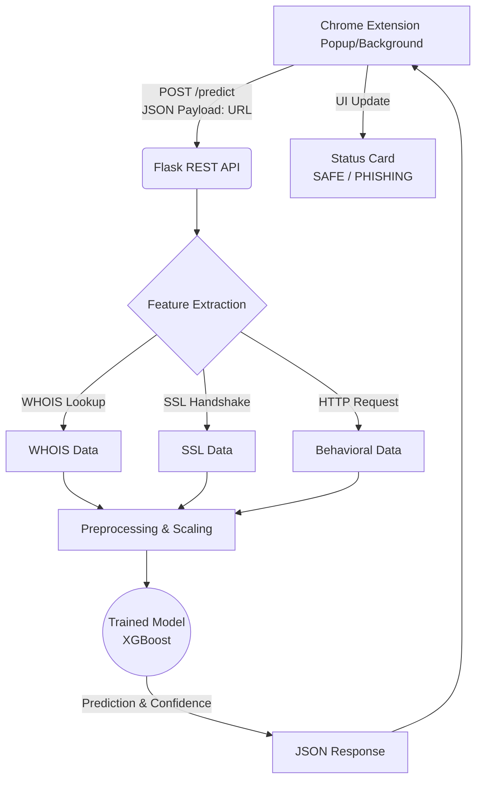

# PhishGuard System Architecture

The following diagram illustrates the data flow for the end-to-end local demonstration system.

```mermaid
graph TD
    A[Chrome Extension Popup/Background] -->|POST /predict\nJSON Payload: URL| B(Flask REST API)
    B --> C{Feature Extraction}
    C -->|WHOIS Lookup| D[WHOIS Data]
    C -->|SSL Handshake| E[SSL Data]
    C -->|HTTP Request| F[Behavioral Data]
    D --> G[Preprocessing & Scaling]
    E --> G
    F --> G
    G --> H((Trained Model\nXGBoost))
    H -->|Prediction & Confidence| I[JSON Response]
    I --> A
    A -->|UI Update| J[Status Card\nSAFE / PHISHING]
```
